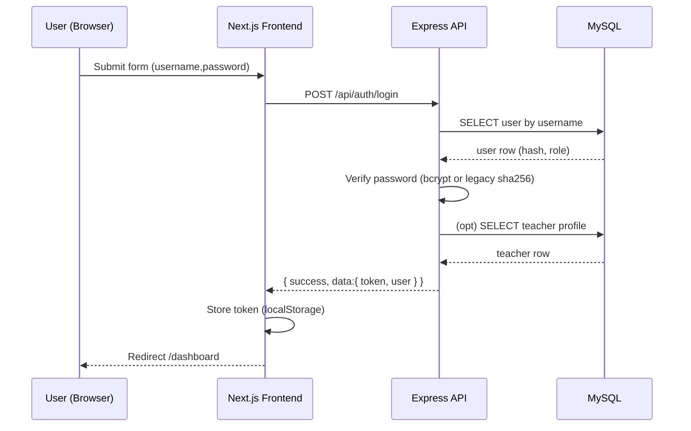
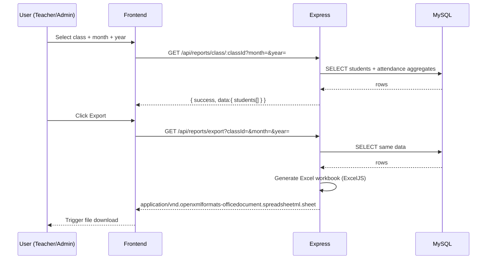

## Sequence Diagrams

### 1. Login (username/password → JWT + profil)


### 2. Isi Absensi (teacher.today → attendance.save)
```mermaid
sequenceDiagram
	participant T as Teacher UI
	participant FE as Frontend
	participant API as Express
	participant DB as MySQL
	T->>FE: Open Dashboard (needs today sessions)
	FE->>API: GET /api/attendance/teacher/:id/today (Bearer token)
	API->>DB: SELECT schedules for teacher + active year
	DB-->>API: schedules[]
	API-->>FE: { success, data: schedules }
	T->>FE: Open one schedule (pick date)
	FE->>API: GET /api/attendance/schedule/:scheduleId?date=YYYY-MM-DD
	API->>DB: Ensure/create attendance_session + fetch students + statuses
	DB-->>API: session + students
	API-->>FE: { success, data:{ session_id, students[] } }
	T->>FE: Mark statuses & Save
	FE->>API: POST /api/attendance/record { schedule_id, attendance_date, records[] }
	API->>DB: BEGIN; DELETE old; INSERT new; COMMIT
	DB-->>API: ok
	API-->>FE: { success, message: 'Absensi disimpan' }
	FE-->>T: Toast success
```

### 3. Laporan (filter kelas/bulan → export Excel)


## Error & Retry Policy (Ringkas)
- Network failure: frontend menampilkan toast error + tombol retry.
- 401/403: redirect ke /login + hapus token.
- 5xx: toast error (aria-live polite) + logging request_id untuk korelasi.
- Idempotensi: POST /attendance/record menghapus & menulis ulang (safe repeat bila gagal sebelum respon).

## Status Utama
- Attendance Session: terjadwal → berlangsung → selesai/dibatalkan (saat ini baru berlangsung digunakan; finalisasi dapat ditambah nanti).

